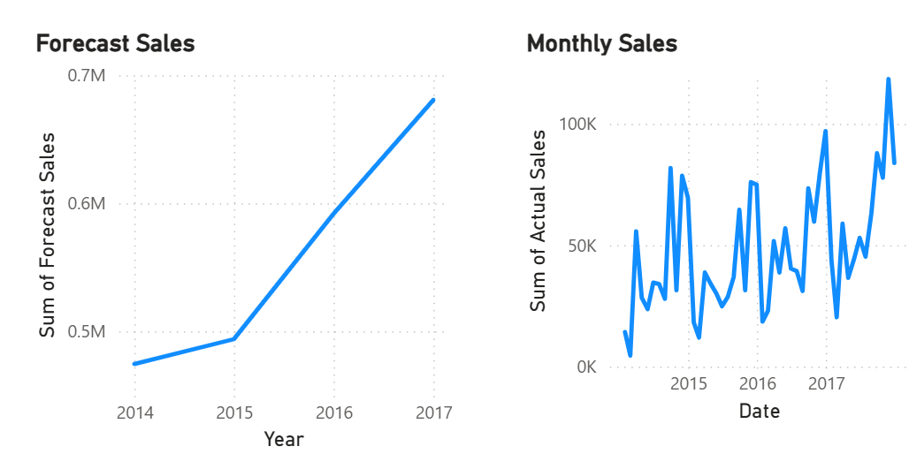

# AI-Powered Sales Forecasting Dashboard

This project implements a sales forecasting system using historical retail sales data to analyze trends and predict future sales performance. The solution focuses on time-series forecasting at a monthly granularity, combining statistical modeling with data visualization to support business decision-making.

The project applies data preprocessing, trend analysis, and forecasting techniques to capture seasonality and long-term sales patterns. A forecasting model is trained on historical data to generate forward-looking sales projections, which are evaluated using standard error metrics and visualized through analytical plots and an interactive dashboard.

The system demonstrates the practical application of time-series forecasting in a business context, highlighting how predictive analytics can be used to support planning, demand estimation, and performance analysis.
  
## Dashboard Preview

